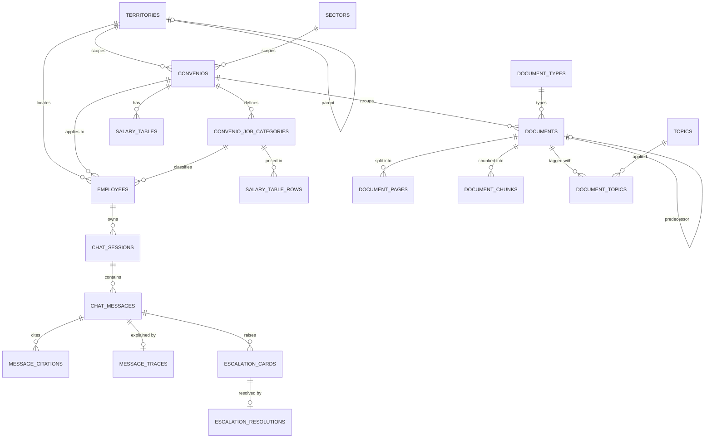

# HR Platform — Data Model

> Canonical location: `hr-docs/architecture/data-model.md`
> Status: **draft for review** (Sprint 0 depends on this)
> This document is the single source of truth for the database schema. Any change to the schema must be reflected here first, then implemented.

---

## 1. Purpose & scope

This defines the relational schema (PostgreSQL + pgvector) for the HR knowledge platform. It encodes the architectural decisions we agreed:

- **Faceted scoping, not a tree.** Documents carry independent facet values; the hierarchy UI is rendered *from* these facets as multiple lenses.
- **Controlled vocabulary for scoping facets.** Scoping facets are foreign keys into vocabulary tables, so an invalid tag is *structurally impossible* — not merely discouraged.
- **Provenance on every tag.** Every tag records who set it, how (filename parse / AI / human), when, and with what confidence. Append-only history.
- **Temporal versioning is first-class.** Documents have validity windows, predecessor/successor lineage, and a retrieval status (draft / active / historical).
- **Salary tables are structured data, never vector chunks.** They are queried, not retrieved by similarity.
- **Identity = email.** Email is both the auth key (email OTP) and the profile-lookup key.

---

## 2. Conventions

- **Primary keys:** Laravel default `id` (`bigint`, auto-increment) internally. Entities exposed in URLs or the API also carry a `uuid` column (employees, admins, documents, chat_sessions, escalation_cards). External references use the `uuid`, never the `id`.
- **Timestamps:** every table has `created_at` / `updated_at` (Laravel convention).
- **Naming:** `snake_case` tables and columns; tables plural; FK columns `<singular>_id`.
- **Enums:** implemented as Postgres enums or string columns with a CHECK constraint (decide per Laravel migration style; documented values are authoritative).
- **Migration ownership:** **Laravel (`hr-backend`) owns the entire relational schema and all migrations.** It is the system of record. The Python service (`hr-ai`) **reads** the registry/scope tables and **reads & writes** `document_chunks` (the vector table) only. `hr-ai` never runs migrations.
- **Money:** `numeric(10,2)`. **Hours:** `numeric(7,2)` (handles `1742`, `1652.13`).

---

## 3. Core relationships (subset)

---

## 4. Group A — Controlled vocabulary & registry

These are the **closed, scoping facets**. New rows here only via a deliberate, logged admin action — never created by the AI or as a side effect of tagging.

### `territories`
The fixed set of territorial scopes, derived from the convenio registry. Renamed from `provinces` in the **Sprint 1 restructure** to express the national → regional → provincial hierarchy that the flat `provinces` table could not. The 2-digit `code` is the prefix of the convenio `numero` for provincial scopes (`01` = Álava, `20` = Gipuzkoa…); regional/national scopes use a registry code (`71` = Andalucía, `99` = Estatal).

> **Sprint 1 restructure (was `provinces`).** `is_national` (boolean) was replaced by `level` (enum `national` \| `regional` \| `provincial`), and a self-referential `parent_territory_id` was added. The Sprint 0 backfill mapped `is_national = true → national`, the Andalucía placeholder (`code 'AN'` → `regional`, re-coded to `71` at import), and everything else → `provincial`. **No precedence/rollup logic is built this sprint** — `parent_territory_id` is recorded where obvious but how a national doc overrides/augments a provincial one is **deferred to the scoping/RAG sprint**. The registry import is authoritative and populates each territory's `aliases` with the Basque/Spanish spelling variants (`Bizkaia`/`Vizcaya`, `Gipuzkoa`/`Guipúzcoa`, `Araba`/`Álava`, plus the sheet's own `PROVINCIA` spelling) so the filename parser never false-conflicts.

> **Level classification (registry import) — numero-prefix range rule (authoritative).** The import derives a territory's `level` from the 2-digit `numero` prefix, **not** by matching the `PROVINCIA` string: `99` → `national`; `01`–`52` → `provincial`; any other 2-digit prefix (the autonomic range, e.g. Andalucía's `71`) → `regional`. The `PROVINCIA` string is used **only as a cross-check**. If the prefix-derived level disagrees with the `PROVINCIA`-implied level, or the prefix falls outside all known ranges (e.g. `00`), the row is **not silently defaulted** — it is logged and surfaced in the import summary as a **flagged** classification for human confirmation (consistent with ADR-0011's managed-growth: the import may create vocabulary, but an ambiguous classification must be visible, not guessed). This replaces the earlier name-match (`ESTATAL`/`ANDALUCIA`/else) approach, which would have silently mislabeled a second autonomous-community convenio as provincial.

| column | type | notes |
|---|---|---|
| id | bigint PK | |
| code | varchar(8) UNIQUE NULL | `01`, `20`, `28`, `99`, `71`… (NULL allowed for codeless scopes) |
| name | varchar | canonical spelling (e.g. `Álava`) |
| level | enum | `national` \| `regional` \| `provincial` |
| parent_territory_id | bigint FK → territories NULL | hierarchy link; **no precedence logic this sprint** |
| aliases | jsonb | alternate spellings matched on ingest (`Araba`, `ALABA`, `Bizkaia`, `Vizcaia`…) |

### `sectors`
The activity sectors (Ocio Educativo, Deporte, Agencias de Viajes, Acción e Intervención Social, …).

| column | type | notes |
|---|---|---|
| id | bigint PK | |
| name | varchar UNIQUE | canonical sector name |
| aliases | jsonb | alternate spellings/codes |

### `convenios`
The authoritative registry, sourced from the `LABOUR AGREEMENTS` sheet of `01_listado_convenios.xlsx` (headers: `NUMERO`, `CONVENIO`, `PROVINCIA`, `HORAS ANUALES`, `HORAS SEMANA`, `NUMERO A3`, `COMPLEMENTO IT`). The central scoping object: a convenio fixes territory + sector + headline conditions. Import is idempotent (keyed on `numero`).

| column | type | notes |
|---|---|---|
| id | bigint PK | |
| numero | varchar UNIQUE | official code, e.g. `71103505012022`; the registry is treated as **one convenio per numero** |
| name | varchar | the canonical `CONVENIO` title (the more formal/longer spelling when duplicate-numero rows disagree) |
| aliases | jsonb NULL | name variants for the same convenio (folded duplicate-numero spellings), consistent with `territories.aliases` / `sectors.aliases`; the convenio resolver matches `name` **and** `aliases` so either spelling resolves to the one convenio |
| territory_id | bigint FK → territories | renamed from `province_id` in Sprint 1; the territory `level` is derived by the **numero-prefix range rule** (see `territories`), with the `PROVINCIA` column used only as a cross-check |
| sector_id | bigint FK → sectors | |
| annual_hours | numeric(7,2) NULL | headline value; per-category overrides live in `convenio_job_categories` |
| weekly_hours | numeric(5,2) NULL | headline value |
| numero_a3 | varchar NULL | the `NUMERO A3` column from the index |
| it_complement | varchar NULL | `COMPLEMENTO IT` description |
| notes | text NULL | for multi-value headline cells e.g. `1742 (1698)` |

> **Multi-value cells** (`1742 / 1652,13`, `38,5 / 36,5`) are *not* stored as text here for retrieval. The split values belong to specific job categories — see `convenio_job_categories`. The raw headline is preserved in `notes` for reference.

> **Duplicate-numero rows are merged (registry import).** The registry contains real cases where one numero appears on two rows under different `CONVENIO` spellings (a formal title + a colloquial one — e.g. `20000785011981` as `LIMPIEZA EDIFICIOS Y LOCALES` and `LIMPIEZA DE GIPUZKOA`). The import collapses them into **one** convenio, keyed on `numero`: it keeps the canonical (more formal/longer) name, folds every other distinct spelling into `aliases` (no name is lost), and for every other field prefers the **non-null / more-complete** value (so a populated `COMPLEMENTO IT` is never overwritten by a NULL duplicate row). Every merge is **logged** (import summary + `Log::warning`) — an ambiguous merge is surfaced, not silent (ADR-0011 managed growth). The merge is idempotent: re-running yields the same single convenio, same aliases, and the same logged summary.

### `convenio_job_categories`
The sub-category granularity that the split cells imply, and that the salary tables enumerate (Director/a Gerente, Jefe/a de Departamento, Técnico/a, Animador/a Sociocultural, …). This is what lets scoping resolve to the *correct* value, not just the convenio.

| column | type | notes |
|---|---|---|
| id | bigint PK | |
| convenio_id | bigint FK → convenios | |
| name | varchar | job category / group name |
| group_code | varchar NULL | e.g. `2.1`, `3.2`, `4.1` (as in Cantabria table) |
| annual_hours | numeric(7,2) NULL | category-specific override |
| weekly_hours | numeric(5,2) NULL | category-specific override |

### `document_types`
Closed vocabulary: `convenio_text`, `salary_tables`, `changes` (Cambios), `partial_agreement` (Acuerdo Parcial), `summary` (Resumen), `national_law` (Estatuto), `internal_hr_ruling`, `other`.

| column | type | notes |
|---|---|---|
| id | bigint PK | |
| code | varchar UNIQUE | machine value |
| name | varchar | display label |

### `topics` — *managed* vocabulary (the one exception)
Descriptive facet, **seeded from the FAQ sheet's 11 categories** (jornada, vacaciones, festivos, permisos retribuidos, bajas médicas, conciliación, excedencias, retribución, permisos no retribuidos, normativa/derechos, formación). The AI may **propose** a new topic (`status = proposed`); only an admin approves it (`status = approved`). The AI can never create an approved topic.

| column | type | notes |
|---|---|---|
| id | bigint PK | |
| name | varchar UNIQUE | |
| status | enum | `approved` \| `proposed` |
| proposed_by | enum NULL | `ai_agent` \| `admin` |
| approved_by | bigint FK → admins NULL | |

---

## 5. Group B — Documents, pages, chunks

### `documents`
One row per source document (the main convenio PDF, a Tablas PDF, a Cambios PDF, the Estatuto, an internal ruling…).

| column | type | notes |
|---|---|---|
| id | bigint PK | |
| uuid | uuid UNIQUE | external reference |
| title | varchar | |
| source_filename | varchar NULL | original filename (parser input) |
| storage_path | varchar | object-storage key for the original file |
| content_hash | varchar(64) NULL, indexed | sha256 of the file bytes — **primary idempotency key** for re-upload (Sprint 1); `(source_filename + convenio_id)` is the fallback |
| convenio_id | bigint FK → convenios NULL | NULL for universal docs (Estatuto, national law) |
| document_type_id | bigint FK → document_types | |
| validity_start | date NULL | |
| validity_end | date NULL | NULL = open-ended |
| retrieval_status | enum | `draft` \| `active` \| `historical` |
| authority_level | enum | `national_law` \| `official_convenio` \| `internal_hr_ruling` |
| predecessor_document_id | bigint FK → documents NULL | version lineage (e.g. 2020–2023 → 2024–2027) |
| language | varchar | `es`, `eu`, … — **metadata only** (ADR-0006): recorded for citation/display, **never** used to filter or scope retrieval. Sprint 1 sets `es` for every document. Some documents are **bilingual** (Euskara + Spanish in parallel columns, e.g. Gipuzkoa bulletin convenios); all carry full Spanish text, so no `eu` splitting/detection is attempted this sprint |
| tagging_status | enum | `auto_proposed` \| `under_review` \| `verified` |
| tagging_confidence | numeric(4,3) NULL | min confidence across auto-assigned facets; drives the review queue |
| ingested_at | timestamp | |
| ingested_by | bigint FK → admins NULL | |

> **Retrieval rule:** only `retrieval_status = active` documents are cited as current. `historical` docs are still retrievable for time-scoped questions ("what were my hours in 2022?") but never presented as current. `draft` docs are excluded from employee-facing retrieval entirely.
> **Authority rule:** on conflict, `national_law` < `official_convenio` is the floor; `internal_hr_ruling` must not override an `official_convenio` for the same scope — if they conflict, re-escalate.

> **Document scope is derived via the convenio (Sprint 1 decision).** A document's **territory** and **sector** are **not** columns on `documents` — they are reached through the document's `convenio` (which fixes both). The only **re-assignable document facets** are therefore `convenio` and `document_type`; the filename parser's territory/sector resolution is used **only for conflict detection + provenance**, with the **convenio authoritative**. This deliberately makes a document-vs-convenio territory contradiction structurally impossible, at the cost of a small deviation from ADR-0001's independent-facet framing (here territory/sector are dependent on the convenio facet). National-law docs carry **universal** scope via `authority_level = national_law` (`convenio_id` and any territory are NULL).
> **Known limitation:** a document that is **territory-scoped but has no convenio** (a regional/provincial *non-convenio* policy doc) cannot currently carry its scope, since scope rides on the convenio. The corpus has no such case today (the only no-convenio docs are national: the Estatuto / national law). Revisit — e.g. an optional direct `territory_id` on `documents`, or a lightweight scope-tag — only if such a document appears.

### `document_pages`
Mirrors the per-page text + image structure already produced by ingestion. Enables citations that show the exact source page.

| column | type | notes |
|---|---|---|
| id | bigint PK | |
| document_id | bigint FK → documents | |
| page_number | int | |
| text | text | extracted page text |
| image_path | varchar NULL | object-storage key for the page image |

### `document_topics` (many-to-many + provenance)
A document covers multiple topics; each association carries its own provenance.

| column | type | notes |
|---|---|---|
| id | bigint PK | |
| document_id | bigint FK → documents | |
| topic_id | bigint FK → topics | |
| source | enum | `filename_parse` \| `ai_agent` \| `admin_manual` |
| confidence | numeric(4,3) NULL | |
| verified_by | bigint FK → admins NULL | set when a human confirms |
| verified_at | timestamp NULL | |

### `document_chunks` (the vector table — owned read/write by `hr-ai`)
Prose chunks for RAG. Scope columns are **denormalized** on purpose so the vector search can pre-filter by scope *before* similarity ranking.

| column | type | notes |
|---|---|---|
| id | bigint PK | |
| document_id | bigint FK → documents | |
| chunk_index | int | order within document |
| page_from | int NULL | |
| page_to | int NULL | |
| content | text | chunk text |
| token_count | int | |
| embedding | vector(1024) | pgvector; **EMBED_DIM = 1024** (BGE-M3, multilingual, self-hostable). Locked after a first-task retrieval test in `hr-ai` on real ES + EU convenios. |
| convenio_id | bigint NULL | denormalized scope filter |
| territory_id | bigint NULL | denormalized scope filter (renamed from `province_id` in Sprint 1; unused this sprint — no chunking yet) |
| sector_id | bigint NULL | denormalized scope filter |
| validity_start | date NULL | denormalized scope filter |
| validity_end | date NULL | denormalized scope filter |
| retrieval_status | enum | denormalized scope filter |
| authority_level | enum | denormalized scope filter |

> Index: an IVFFlat/HNSW index on `embedding`, plus btree indexes on the scope columns. Salary tables are **never** chunked into this table.
> Note: `language` is deliberately **not** a scope column — retrieval never filters by language (see §5 `documents.language`).

---

## 6. Group C — Salary tables (structured)

### `salary_tables`
A versioned salary table belonging to a convenio and a year/validity.

| column | type | notes |
|---|---|---|
| id | bigint PK | |
| convenio_id | bigint FK → convenios | |
| year | int NULL | e.g. 2025, 2026 |
| validity_start | date NULL | |
| validity_end | date NULL | |
| source_document_id | bigint FK → documents NULL | the Tablas PDF/xlsx it came from |

### `salary_table_rows`
One row per job category. Common concepts are typed columns (for reliable queries); the convenio-specific long tail is preserved in `raw_values`.

| column | type | notes |
|---|---|---|
| id | bigint PK | |
| salary_table_id | bigint FK → salary_tables | |
| job_category_id | bigint FK → convenio_job_categories | |
| gross_annual | numeric(10,2) NULL | |
| base_salary_monthly | numeric(10,2) NULL | |
| extra_pay | numeric(10,2) NULL | pagas extra |
| num_payments | int NULL | 12 / 14 |
| hourly_rate | numeric(8,4) NULL | €/hora |
| night_plus | numeric(10,2) NULL | plus nocturno |
| raw_values | jsonb | every original column verbatim (SB, COMP, SMI comp, totals…) |

---

## 7. Group D — People, auth, roles

### `employees`
Email is mandatory and unique — it is the identity and lookup key.

| column | type | notes |
|---|---|---|
| id | bigint PK | |
| uuid | uuid UNIQUE | |
| email | varchar UNIQUE | **mandatory**; auth + profile key |
| full_name | varchar | |
| employee_external_id | varchar NULL | Sedena's own ID if any |
| convenio_id | bigint FK → convenios | |
| job_category_id | bigint FK → convenio_job_categories NULL | resolves split-value granularity |
| territory_id | bigint FK → territories | renamed from `province_id` in Sprint 1; employee's **own** location scope (may differ from an Estatal convenio) |
| work_location | varchar NULL | town/centre, e.g. "CaixaForum Palma" |
| employment_type | enum | `full_time` \| `part_time` (affects e.g. vacation calc) |
| start_date | date NULL | antigüedad |
| status | enum | `active` \| `inactive` |
| profile_last_reviewed_at | timestamp NULL | staleness signal (no HRIS sync) |

### `employee_audit_log`
Because the profile determines which legal answers an employee receives, every profile change is recorded.

| column | type | notes |
|---|---|---|
| id | bigint PK | |
| employee_id | bigint FK → employees | |
| field_changed | varchar | e.g. `territory_id`, `convenio_id`, `email` |
| old_value | text NULL | |
| new_value | text NULL | |
| changed_by | bigint FK → admins | |
| changed_at | timestamp | |

> Editing `email` changes how the employee logs in — flag this in the admin UI.

### `admins`, roles & permissions
Admin accounts. **Roles/permissions via the `spatie/laravel-permission` package** — we do not hand-roll those tables; the package supplies `roles`, `permissions`, and pivots. Conceptual roles: `super_admin`, `hr_agent` (handles escalations), `knowledge_editor` (edits docs/tags, no chat access), `auditor` (read-only).

| column (admins) | type | notes |
|---|---|---|
| id | bigint PK | |
| uuid | uuid UNIQUE | |
| email | varchar UNIQUE | |
| full_name | varchar | |
| status | enum | `active` \| `inactive` |

> Privacy: `hr_agent` sees escalated conversations, not every employee's full chat history. Enforced via permissions, documented in the architecture doc.

### `login_codes` (email OTP)
| column | type | notes |
|---|---|---|
| id | bigint PK | |
| account_type | enum | `employee` \| `admin` |
| email | varchar | indexed (rate-limit by email) |
| code_hash | varchar | **hash only**, never the plaintext code |
| expires_at | timestamp | 5–10 min TTL |
| consumed_at | timestamp NULL | single-use |
| attempts | int default 0 | cap verification attempts (brute-force guard) |

> Sessions: **Laravel Sanctum** bearer tokens to the React SPA, **~24h TTL** (the "daily session" decision). Requesting a new code invalidates outstanding codes for that email. Delivery via **Postmark**.

---

## 8. Group E — Chat & traces

### `chat_sessions`
| column | type | notes |
|---|---|---|
| id | bigint PK | |
| uuid | uuid UNIQUE | |
| employee_id | bigint FK → employees | |
| started_at | timestamp | |
| last_activity_at | timestamp | |

### `chat_messages`
| column | type | notes |
|---|---|---|
| id | bigint PK | |
| session_id | bigint FK → chat_sessions | |
| role | enum | `user` \| `assistant` |
| content | text | |
| created_at | timestamp | |

### `message_citations`
| column | type | notes |
|---|---|---|
| id | bigint PK | |
| message_id | bigint FK → chat_messages | |
| document_id | bigint FK → documents | |
| chunk_id | bigint FK → document_chunks NULL | |
| page_number | int NULL | for source-page display |

### `message_traces`
The expandable "how I got here" trace — stored **structured**, so it doubles as an eval/QA dataset.

| column | type | notes |
|---|---|---|
| id | bigint PK | |
| message_id | bigint FK → chat_messages | |
| trace | jsonb | profile detected, scope filters applied, router decision, retrieved chunks + scores, guardrail result, confidence |

---

## 9. Group F — Escalations

### `escalation_cards`
| column | type | notes |
|---|---|---|
| id | bigint PK | |
| uuid | uuid UNIQUE | |
| chat_session_id | bigint FK → chat_sessions NULL | |
| source_message_id | bigint FK → chat_messages NULL | |
| employee_id | bigint FK → employees | |
| reason | enum | `low_confidence` \| `sensitive_topic` \| `off_domain` \| `explicit_request` \| `conflict` |
| status | enum | `new` \| `assigned` \| `in_progress` \| `resolved` \| `closed` |
| assigned_to | bigint FK → admins NULL | |
| topic_id | bigint FK → topics NULL | |
| created_at | timestamp | |
| resolved_at | timestamp NULL | |

### `escalation_resolutions`
The resolution, and the link to the knowledge article it becomes (the flywheel).

| column | type | notes |
|---|---|---|
| id | bigint PK | |
| card_id | bigint FK → escalation_cards | |
| resolved_by | bigint FK → admins | |
| resolution_text | text | |
| converted_to_document_id | bigint FK → documents NULL | the new article, if converted |
| created_at | timestamp | |

> When converted, the new `documents` row defaults to `authority_level = internal_hr_ruling` and **inherits the original asker's scope** (convenio/territory) — scope must be confirmed before publish.

---

## 10. Group G — Tag provenance & review (cross-cutting)

### `tag_events` (append-only provenance log)
The complete history behind every facet decision. This is what powers the change-log timeline on each document card and the legal-defensibility audit trail.

| column | type | notes |
|---|---|---|
| id | bigint PK | |
| entity_type | varchar | `document` \| `document_topic` \| … |
| entity_id | bigint | |
| facet | varchar | `convenio` \| `territory` \| `sector` \| `document_type` \| `topic` \| `validity` |
| old_value | text NULL | |
| new_value | text NULL | |
| source | enum | `filename_parse` \| `ai_agent` \| `admin_manual` \| `system` |
| actor_id | bigint FK → admins NULL | set for manual actions |
| confidence | numeric(4,3) NULL | for parse/AI |
| note | text NULL | |
| created_at | timestamp | |

### `document_review_tasks`
Tracks human handoffs surfaced to admins. The **expiry queue is primarily a query** over `documents.validity_end` + `retrieval_status = active`; this table tracks the resulting tasks and the successor-handoff confirmation.

| column | type | notes |
|---|---|---|
| id | bigint PK | |
| document_id | bigint FK → documents | |
| type | enum | `expiry` \| `tag_review` \| `conflict` |
| reason | enum NULL | `unresolved` (parser had nothing to resolve — **LLM-eligible** later) \| `conflict` (resolved-but-contradicts-registry — **human-adjudicated**). Added Sprint 1 per ADR-0011 |
| raw_unmatched_values | jsonb NULL | the literal string(s) the parser could not resolve (`[{facet, value}, …]`), so a human/agent can later decide "fold into aliases" vs "propose a new vocabulary value" (ADR-0011) |
| status | enum | `open` \| `resolved` \| `dismissed` |
| due_date | date NULL | |
| resolved_by | bigint FK → admins NULL | |
| resolved_at | timestamp NULL | |

> **Two-reason routing (ADR-0011).** `reason` is set at ingest: a `conflict` is written when parsed values contradict the registry (territory disagreement, unknown convenio, sector disagreement) and a `system` `tag_events` row is logged on each conflicting facet; `unresolved` is written when the parser had nothing to resolve or hit an unmatched controlled value (e.g. a no-numero PDF). Conflict outranks unresolved. The LLM rescue path and propose-new-value UI are **deferred** to the LLM-tagging-tier sprint — Sprint 1 only lays these two fields.

---

## 11. How scoping resolves (read path)

1. Authenticated employee → `employees` row (via email) → profile: `convenio_id`, `job_category_id`, `territory_id`, `employment_type`, plus the question date (default = today).
2. **Eligible documents** = those where:
   - `convenio_id` matches the employee's convenio, **or** `authority_level = national_law` (universal, e.g. Estatuto), **and**
   - `retrieval_status = active`, **and**
   - the question date falls within `[validity_start, validity_end]`.
3. **Salary questions** → structured lookup: `salary_tables` for the convenio + active year → `salary_table_rows` filtered by the employee's `job_category_id`. (No vector search.)
4. **Prose questions** → vector search over `document_chunks` pre-filtered by the denormalized scope columns from step 2.
5. Every step is written to `message_traces.trace`.

This is the deterministic part of the pipeline (Laravel resolves the scope, then calls `hr-ai` with the query + scope filters). It carries the legal weight, so it is **not** left to LLM reasoning.

---

## 12. Resolved decisions & remaining open item

**Resolved (fold into Sprint 0):**

1. **Embedding model & dimension.** `BGE-M3` (multilingual, self-hostable, open-weight), `EMBED_DIM = 1024`. Confirmed by a retrieval test on real ES + Euskara convenios as the **first task in `hr-ai`** before the `vector(1024)` column is locked.
2. **Language handling.** `documents.language` is recorded for citation and display only. Retrieval **never** filters or scopes by language — search runs across all languages. Language is therefore **not** a facet and **not** a lens.
3. **Admin authentication.** Same email-OTP flow as employees. No schema change — `login_codes.account_type` already covers both.
4. **`work_location`.** Stays **free text** for now. It is descriptive, not legally load-bearing (territory + convenio drive scoping, and both are controlled). Promote to a controlled `locations` vocabulary only if a future "by location" lens is wanted.
5. **Object storage.** **S3-compatible storage.** Original files and page images live in an S3 bucket; `storage_path` / `image_path` hold opaque object keys. A single storage adapter (used by `hr-backend` for uploads and `hr-ai` for reads) wraps the S3 client, so swapping bucket/provider or pointing at an S3-compatible service (e.g. MinIO for local dev) never touches the schema or callers.

_All open questions are now resolved; the schema is ready to build from._

